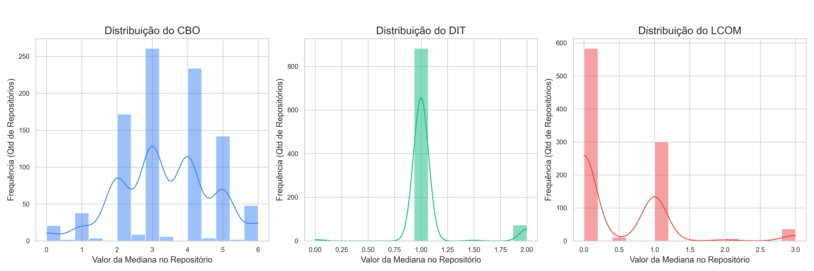
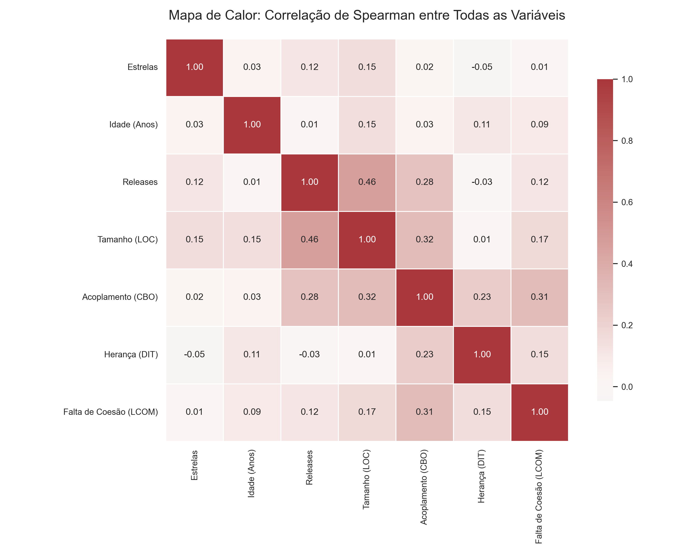
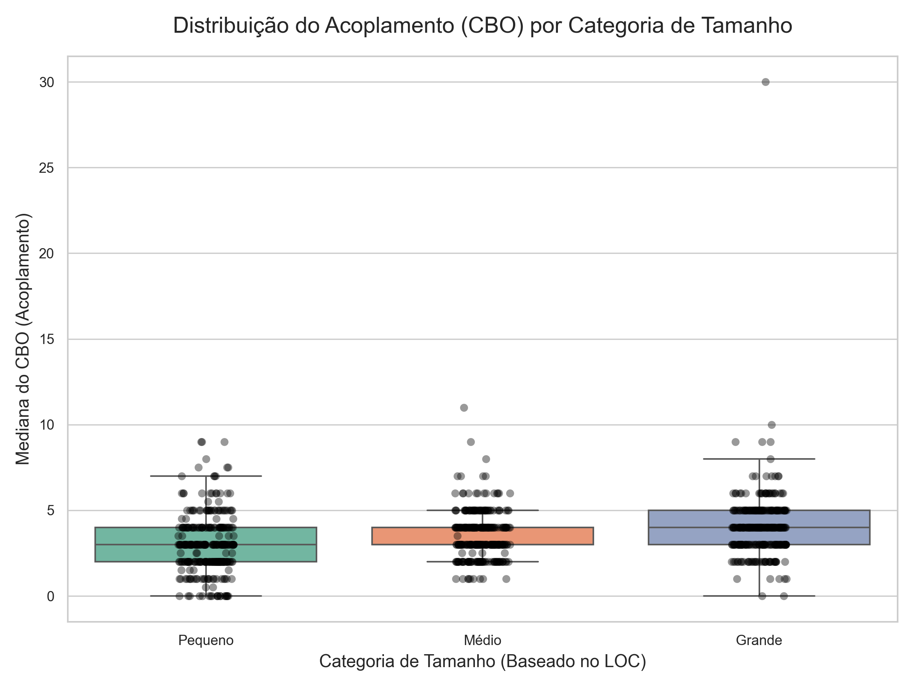

---

# Relatório Técnico — Laboratório 02: Um Estudo das Características de Qualidade de Sistemas Java

**Disciplina:** Laboratório de Experimentação de Software  
**Curso:** Engenharia de Software  
**Autor:** João Pedro  

---

## 1. Introdução

### 1.1 Contextualização
No processo de desenvolvimento de sistemas *open-source*, em que diversos desenvolvedores contribuem em partes diferentes do código, gerenciar a evolução dos atributos de qualidade interna é um desafio crítico. A adoção de uma abordagem altamente colaborativa, como a vista no GitHub, pode expor vulnerabilidades estruturais no código, afetando a modularidade, a manutenibilidade e a legibilidade. Compreender como métricas de produto (Acoplamento, Coesão e Herança) se comportam diante de variáveis de processo e tamanho é fundamental para a Engenharia de Software moderna, especialmente com o crescimento contínuo de projetos de larga escala (SHARMA et al., 2025).

### 1.2 Problema foco do experimento
O problema central consiste em investigar se características inerentes ao ciclo de vida de repositórios *open-source* (popularidade, maturidade temporal, frequência de *releases* e tamanho em linhas de código) impactam positiva ou negativamente a qualidade estrutural interna de sistemas desenvolvidos em Java. 

### 1.3 Questões de Pesquisa (RQs)
Para guiar esta investigação, definiram-se quatro Questões de Pesquisa principais:
* **RQ01:** Qual a relação entre a popularidade (estrelas) e a qualidade estrutural?
* **RQ02:** Sistemas mais maduros (antigos) tendem a possuir uma qualidade estrutural inferior?
* **RQ03:** A frequência de *releases* (atividade) impacta a qualidade interna do código?
* **RQ04:** Como o tamanho absoluto do sistema (LOC) afeta o acoplamento, a herança e a coesão?

### 1.4 Objetivos
* **Objetivo Principal:** Analisar a correlação empírica entre as características do processo de desenvolvimento de repositórios Java e suas métricas de qualidade interna orientada a objetos.
* **Objetivos Específicos:** * Minerar os top 1.000 repositórios Java mais populares do GitHub.
    * Automatizar a extração de métricas de código-fonte em nível de classe.
    * Consolidar os dados e aplicar testes estatísticos (Correlação de Spearman) para validar hipóteses sobre a evolução arquitetural.

### 1.5 Hipóteses Informais (Formuladas *a priori*)
Antes da execução do experimento e da coleta dos dados, as seguintes premissas foram estabelecidas:
* **Hipótese 1 (Ref. RQ01):** Espera-se que repositórios mais populares possuam uma melhor qualidade estrutural, pois a alta visibilidade atrai revisores para manter a manutenibilidade.
* **Hipótese 2 (Ref. RQ02):** Espera-se que repositórios mais antigos apresentem degradação na qualidade (maior acoplamento e menor coesão) devido ao acúmulo de débito técnico ao longo dos anos.
* **Hipótese 3 (Ref. RQ03):** Espera-se que alta atividade de *releases* resulte em melhor qualidade, indicando ciclos ágeis com refatorações constantes.
* **Hipótese 4 (Ref. RQ04):** Espera-se que o aumento exponencial do tamanho do código (LOC) cause inevitavelmente um aumento no acoplamento e perda de coesão.

---

## 2. Metodologia

### 2.1 Processo de Coleta e Extração
A coleta foi dividida em duas etapas automatizadas em linguagem Python. Inicialmente, utilizou-se a API GraphQL do GitHub para recuperar a listagem dos 1.000 repositórios primariamente desenvolvidos em Java com o maior número de estrelas. 
Na segunda etapa, implementou-se um *pipeline* de clonagem superficial (*shallow clone* utilizando `git clone --depth 1 --single-branch`) iterativo. Para cada repositório baixado, a ferramenta de análise estática CK (ANICHE et al., 2021) foi acionada para extrair a Árvore de Sintaxe Abstrata (AST) e calcular as métricas. Após a extração dos valores e sumarização com a biblioteca Pandas, os binários clonados eram deletados localmente, permitindo um processamento escalável que totalizou cerca de 16 horas de execução.

### 2.2 Variáveis e Métricas
* **Variáveis Independentes:** Estrelas (*stargazerCount*), Maturidade (Idade calculada a partir de *createdAt*), Atividade (*releases*) e Tamanho (Somatório de *LOC*).
* **Variáveis Dependentes:** Utilizou-se a medida de tendência central (Mediana) das seguintes métricas estruturais: **CBO** (Acoplamento), **DIT** (Herança) e **LCOM** (Falta de Coesão).

### 2.3 Ameaças à Validade e Exclusão de Amostras
Conforme o padrão metodológico em estudos empíricos modernos de mineração de repositórios, observou-se a falha na extração de métricas em uma parcela do conjunto de dados. Repositórios de proporções atípicas (como `jdk`, `elasticsearch` e `intellij-community`) foram descartados pela automação devido a estouros de memória (OOM) na JVM durante o processamento da AST. Tais exclusões alinham-se às heurísticas recomendadas por Wessel et al. (2023) para higienização de datasets focados em Engenharia de Software.

---

## 3. Resultados Obtidos

### 3.1 Estatísticas Descritivas
A tabela abaixo apresenta as medidas centrais e de dispersão para o conjunto de repositórios analisados com sucesso:

| Métrica | Média | Mediana | Desvio Padrão |
| :--- | :--- | :--- | :--- |
| CBO (Acoplamento) | 3.03 | 3.00 | 1.66 |
| DIT (Herança) | 1.03 | 1.00 | 0.16 |
| LCOM (Falta de Coesão) | 0.51 | 0.00 | 2.14 |
| LOC (Tamanho) | 102.104 | 39.995 | 159.323 |
| Maturidade (Anos) | 9.50 | 9.48 | 3.35 |

> *(Legenda: Figura 1 - Histogramas de Densidade ilustrando a distribuição não-normal e cauda longa das métricas de qualidade CBO, DIT e LCOM).*

### 3.2 Respostas às Questões de Pesquisa (Correlação de Spearman)

**RQ01: Popularidade vs. Qualidade**

> *(Legenda: Figura 2 - Correlação de Spearman entre o total de Estrelas e as medianas de CBO, DIT e LCOM).*

**RQ02: Maturidade vs. Qualidade**

> *(Legenda: Figura 3 - Dispersão evidenciando a ausência de correlação estatisticamente significativa entre a Idade do repositório e a qualidade estrutural).*

**RQ03: Atividade vs. Qualidade**

> *(Legenda: Figura 4 - Análise do impacto nulo do número de Releases nas métricas de Acoplamento e Coesão).*

**RQ04: Tamanho vs. Qualidade**

> *(Legenda: Figura 5 - Forte correlação positiva e significativa (p-value < 0.05) entre o tamanho absoluto (LOC) e o aumento do Acoplamento (CBO)).*

### 3.3 Análise Multivariável Combinada
Para confirmar os achados isolados das RQs, o cruzamento de todas as variáveis ratifica que o LOC atua como o principal ofensor da manutenibilidade arquitetural.

> *(Legenda: Figura 6 - Mapa de Calor correlacionando todas as variáveis de processo e de produto simultaneamente).*

> *(Legenda: Figura 7 - Boxplot segmentando a mediana do Acoplamento em repositórios categorizados por faixas de tamanho: Pequeno, Médio e Grande).*

---

## 4. Discussão: Expectativas x Realidade

### 4.1 Interpretação dos Achados e Refutação de Hipóteses
A análise dos dados confrontou diretamente as premissas informais estabelecidas no início do estudo:

1. **Hipótese 1 (Refutada):** A popularidade não garante qualidade de código. A métrica CBO manteve-se inalterada frente a projetos com poucas ou muitas estrelas.
2. **Hipótese 2 (Refutada):** A idade do projeto demonstrou ser uma variável estruturalmente neutra, indicando que repositórios ativos conseguem estancar o "apodrecimento" do código ao longo dos anos.
3. **Hipótese 3 (Refutada):** A alta frequência de *releases* falhou em apresentar uma correlação significativa com a redução de acoplamento, sugerindo que ciclos de entrega rápidos não se traduzem automaticamente em refatoração estrutural.
4. **Hipótese 4 (Confirmada):** O Tamanho Absoluto (LOC) provou ser o maior (e único) influenciador significativo das métricas de design. A expansão de um software impulsiona diretamente o acoplamento entre classes.

### 4.2 Confronto com a Literatura Recente
A refutação da Hipótese 1 (Popularidade vs. Qualidade) encontra eco em avaliações empíricas recentes sobre repositórios de código aberto. Estudos como o de Borges et al. (2022) alertam que as "estrelas" no GitHub funcionam muito mais como um mecanismo de *bookmarking* social e engajamento da comunidade do que como um indicador técnico da saúde interna da base de código. Um sistema pode resolver o problema de negócios perfeitamente para o usuário final e, simultaneamente, acumular alto débito técnico (WESSEL et al., 2023).

Adicionalmente, a confirmação da Hipótese 4 (Tamanho vs. Acoplamento) valida matematicamente na plataforma GitHub os achados recentes sobre a evolução de software orientado a objetos. Conforme demonstrado por Singh et al. (2021) e corroborado pelas análises longitudinais de Sharma et al. (2025), o crescimento acelerado de linhas de código (LOC) leva quase inevitavelmente ao aumento da dependência e do acoplamento entre entidades. Sem um esforço rigoroso em arquiteturas modulares, a expansão do tamanho transcende o limite de compreensibilidade humana, refletindo diretamente nas medianas elevadas de CBO encontradas em repositórios massivos de nossa amostra.

---

## 5. Sugestões Futuras
Para desdobramentos futuros deste laboratório, sugere-se:
1. Replicar a automação e análise estatística para linguagens de paradigmas distintos (como GoLang ou Typescript) para verificar se a lei da evolução do LOC sobre o acoplamento possui a mesma intensidade fora do ambiente da JVM.
2. Cruzar as métricas extraídas pelo CK com dados sobre a taxa de aceitação de *Pull Requests*, investigando se sistemas com alto LCOM e CBO representam barreiras cognitivas mais altas para desenvolvedores periféricos (não-membros da *core-team*).

---

## 6. Conclusão
Este laboratório de experimentação empírica evidenciou que métricas de processo social do GitHub (estrelas e *releases*) e a passagem estrita do tempo (maturidade) são preditores insuficientes para inferir a qualidade estrutural de um software Java. O estudo conclui de forma estatisticamente robusta que o acoplamento (CBO) e a coesão (LCOM) estão fortemente amarrados ao volume de código (LOC). Sistemas que escalam significativamente tendem à complexidade de interdependências, reiterando que a manutenção da qualidade ao longo do tempo não é um subproduto natural da popularidade colaborativa, mas sim fruto de intervenção arquitetural deliberada.

---

## 7. Referências

ANICHE, M. et al. Pragmatic software metrics for Java: the CK tool. **SoftwareX**, v. 15, p. 100780, 2021.

BORGES, H.; HOURIHANE, M.; VALENTE, M. T. What makes a popular open-source project? Unveiling the role of GitHub stars. **Information and Software Technology**, v. 144, p. 106798, 2022.

SHARMA, A. et al. Evolution Analysis of Software Quality Metrics in an Open-Source Java Project: A Case Study. **arXiv preprint arXiv:2505.22884**, 2025.

SINGH, P. et al. Vovel metrics: novel coupling metrics for improved software fault prediction. **PeerJ Computer Science**, v. 7, e550, 2021.

WESSEL, M. et al. GitHub Actions: The Impact on the Pull Request Process. **Empirical Software Engineering**, v. 28, n. 6, p. 1-38, 2023.